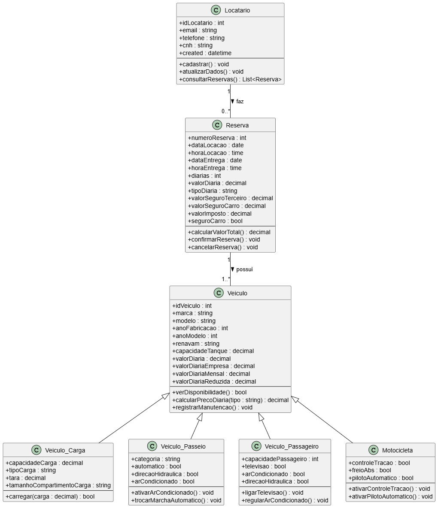

# Diagrama UML - Sistema de Locação de Veículos

Este documento apresenta o **diagrama de classes UML** do sistema de locação de veículos, incluindo:

- **Classes principais**: Locatário, Reserva, Veículo  
- **Especializações de Veículos**: Veículo de Carga, Veículo de Passeio, Veículo de Passageiros, Motocicleta  
- **Relacionamentos**: como as classes se conectam e interagem no sistema

---

## Diagrama de Classes

</>

---

## Descrição das Classes

### Locatário
Representa o cliente que realiza reservas.
- **Atributos principais**: id, email, telefone, CNH, data de criação
- **Funções principais**: 
  - `cadastrar()`
  - `atualizarDados()`
  - `consultarReservas()`

### Reserva
Representa uma reserva de veículo realizada por um locatário.
- **Atributos principais**: número da reserva, datas e horas de locação e entrega, diárias, valores de diárias e seguros
- **Funções principais**: 
  - `calcularValorTotal()`
  - `confirmarReserva()`
  - `cancelarReserva()`

### Veículo
Classe base para todos os tipos de veículos.
- **Atributos principais**: id, marca, modelo, ano, renavam, capacidade do tanque, valores de diárias
- **Funções principais**: 
  - `verDisponibilidade()`
  - `calcularPrecoDiaria(tipo)`
  - `registrarManutencao()`

#### Especializações de Veículos
- **Veículo de Carga**: capacidade de carga, tipo de carga, tara, tamanho do compartimento  
  Função: `carregar(carga)`
- **Veículo de Passeio**: categoria, automático, direção hidráulica, ar-condicionado  
  Funções: `ativarArCondicionado()`, `trocarMarchaAutomatico()`
- **Veículo de Passageiro**: capacidade de passageiros, televisão, ar-condicionado, direção hidráulica  
  Funções: `ligarTelevisao()`, `regularArCondicionado()`
- **Motocicleta**: controle de tração, freio ABS, piloto automático  
  Funções: `ativarControleTracao()`, `ativarPilotoAutomatico()`

---

## Relacionamentos

- Um **Locatário** pode fazer **múltiplas reservas**.  
- Uma **Reserva** está associada a **um ou mais veículos**.  
- A classe **Veículo** possui **especializações** (Carga, Passeio, Passageiro e Motocicleta), que herdam seus atributos e comportamentos.

